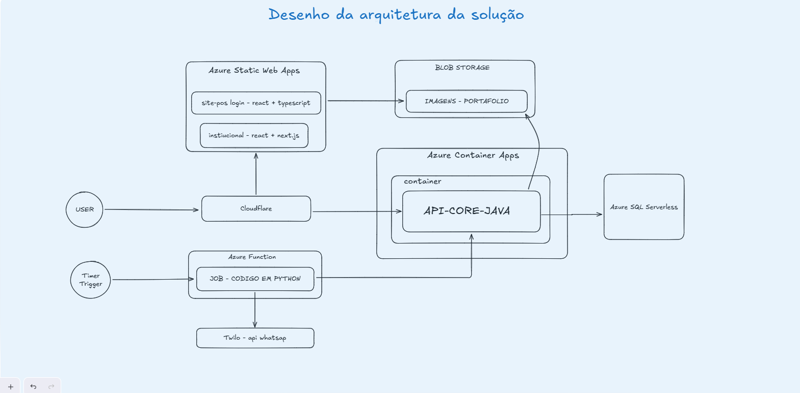
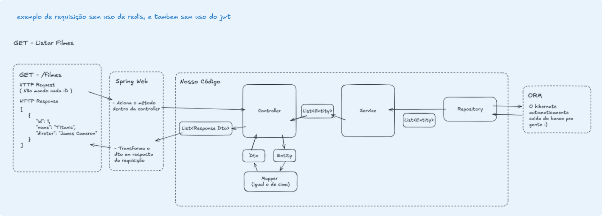
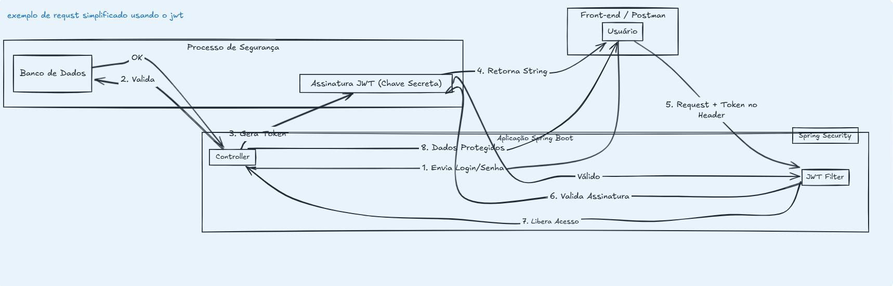
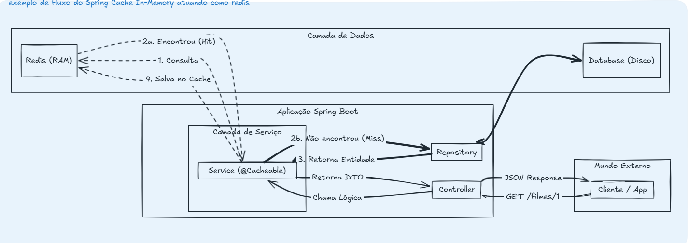

# Registro de Decisões de Arquitetura (ADR) - Sistema de Gestão

Este documento detalha as escolhas técnicas para o sistema de gestão de barbearia. Ele foi estruturado para apoiar o entendimento do grupo sobre as tecnologias que utilizaremos ao longo do ano, explicando não apenas o "o quê", mas principalmente o "porquê" de cada decisão.

---

## ADR 001: Infraestrutura e Serviços Gerenciados na Azure
**Status:** Aceito

### Contexto
Precisamos de um local na nuvem para colocar nossos sites, banco de dados e a nossa API. O ambiente precisa ser seguro, ter um custo extremamente controlado para o nosso contexto acadêmico e escalar conforme o uso do sistema.

### Decisão e Justificativas
Optamos pelo ecossistema Microsoft Azure utilizando serviços "Serverless/PaaS". 

* **Azure Static Web Apps:** Usado para hospedar os nossos sites (Front-end). Ele já fornece nativamente o **Certificado SSL (HTTPS)**. Isso não é apenas um detalhe técnico de criptografia (que impede que senhas sejam interceptadas), mas sim uma questão crucial de **confiança do cliente**. Se utilizássemos apenas HTTP, navegadores como o Chrome exibiriam um alerta de "Site Não Seguro", espantando os clientes. Com o HTTPS nativo, garantimos o ícone do "cadeado" de segurança sem precisarmos comprar ou renovar certificados manualmente.
* **Azure Container Apps (Hospedagem da API):** Em vez de alugar uma Máquina Virtual (VM) que fica ligada gastando dinheiro 24h por dia, optamos por Containers com um **funcionamento misto (Scale-to-Zero)**. 
    * **Como funciona na prática:** Durante o dia (horário comercial da barbearia), a API fica ligada e, se tiver muitos acessos, a Azure cria cópias automaticamente. Durante a noite e de madrugada, quando ninguém faz agendamentos, o Container App "hiberna" (escala para zero). Como é Serverless, **só pagamos pelo tempo em que ele estiver processando requisições**, gerando uma enorme economia em comparação a uma VM tradicional.
* **Escolha do Proxy/CDN (Cloudflare):** Precisávamos de um serviço de Edge Computing. Avaliamos previamente usar o **AWS CloudFront** ou o **Azure Front Door**. Porém, para o tamanho do nosso projeto, **o custo dessas ferramentas era muito elevado**. Optamos pelo **Cloudflare**, que oferece proteção (WAF) e CDN de altíssima qualidade já no seu plano gratuito.
* **Azure SQL Serverless:** Banco de dados relacional que também pausa a cobrança de processamento quando não está sendo usado.
* **Azure Blob Storage:** Funciona como um "pen-drive" infinito na nuvem para guardar arquivos pesados (fotos de cortes), deixando o Front-end e a API mais leves.

---

## ADR 002: Padrão de Camadas na API (Spring Boot)
**Status:** Aceito

### Contexto
Se colocarmos todo o código em um lugar só, o projeto ficará impossível de manter ao longo do ano. Precisamos de uma estrutura organizada.

### Decisão
Adotamos o padrão de camadas estritas no Java:
1.  **Controller:** Recebe o pedido do usuário (HTTP) e decide para onde vai.
2.  **Service:** É o cérebro. Aqui ficam as regras de negócio.
3.  **Repository:** Só sabe conversar com o banco de dados via ORM (Hibernate).
4.  **DTO (Data Transfer Object) & Mapper:** "Caixas" customizadas para enviar apenas os dados necessários para a tela. Nunca devolvemos a Entidade do banco de dados direto para o usuário, garantindo segurança e ocultando dados sensíveis.

---

## ADR 003: Segurança com JWT (Stateless)
**Status:** Aceito

### Contexto
A API precisa saber quem é o usuário logado para liberar os agendamentos, mas guardar "Sessões" na memória do servidor gasta muitos recursos.

### Decisão
Usaremos **JWT (JSON Web Token)**. Ao fazer login, o servidor cria um "crachá digital assinado" (Token) e entrega ao frontend. Em todas as requisições seguintes, o frontend mostra esse crachá no cabeçalho (Header). A API (através de um Filtro do Spring Security) só precisa validar a assinatura matemática, sem precisar consultar o banco de dados o tempo todo. O servidor fica "Stateless" (sem estado), o que o torna super rápido e pronto para escalar.

---

## ADR 004: Estratégia de Cache In-Memory (Evolução futura para Redis)
**Status:** Aceito

### Contexto
Buscar listas (como serviços ou portfólio) repetidamente no banco de dados deixa a resposta lenta e aumenta os custos do Azure SQL Serverless. Precisamos de uma memória rápida.

### Decisão
Adotaremos o **Spring Cache In-Memory** (memória RAM da própria aplicação Java). A API busca um dado a primeira vez, salva na memória e devolve instantaneamente nas próximas vezes.

### Por que não usar o Redis logo de cara?
O Redis é o padrão de mercado, mas optamos por não usá-lo neste momento por um motivo arquitetural:
* O Redis é essencial **se** tivéssemos vários containers da nossa API rodando ao mesmo tempo (pois precisariam de um cache centralizado) ou se fosse um dado que não pudesse ser perdido caso a API reiniciasse.
* No nosso contexto, rodaremos apenas 1 instância do container para economizar. Adicionar um servidor Redis agora geraria um **custo desnecessário**. O cache em memória atende perfeitamente e, como usamos a anotação padrão (`@Cacheable`), mudar para o Redis no futuro exigirá apenas a troca de uma configuração.

---

## ADR 005: Processamento Assíncrono com Azure Functions e Integração Twilio
**Status:** Aceito

### Contexto
Precisamos rodar rotinas diárias (enviar lembretes de WhatsApp pelo Twilio). Não podemos fazer isso dentro da API principal, senão ela ficaria lenta para os usuários enquanto manda as mensagens.

### Decisão
Criaremos um serviço separado usando **Azure Functions** com código em **Python**, ativado por um "despertador" (Timer Trigger) diário.

### Comunicação com o Core:
A Azure Function **não** fará consultas no banco de dados diretamente. Ela fará requisições HTTP para a nossa própria **API-CORE-JAVA**.
* **Justificativa:** Se o Python acessasse o banco, teríamos que duplicar as regras de negócio nas duas linguagens. Chamando a API Java, mantemos o Backend como a **única fonte da verdade** e o banco de dados totalmente isolado.

---

## ADR 006: Frontend (React, Next.js) e Otimização de SEO
**Status:** Aceito

### Contexto
Precisamos de interfaces rápidas e o site institucional da barbearia precisa ser facilmente encontrado no Google (SEO).

### Decisão
Usaremos **React + TypeScript** para as telas da aplicação e **Next.js** para o site institucional.

### A dinâmica do Next.js e o Blob Storage
O site institucional exibirá imagens e textos que ficarão salvos no **Azure Blob Storage**.
* **O Problema do React puro (SPA):** Num React normal, o navegador recebe uma tela em branco e carrega os dados depois. O robô do Google lê a página vazia, arruinando o ranqueamento.
* **A Solução com Next.js:** O Next.js usa renderização no servidor (SSR). Ele vai até o Blob Storage, pega as fotos e textos, monta o HTML completo e **só então** entrega. O robô do Google consegue ler todo o conteúdo perfeitamente, garantindo o SEO sem precisarmos alterar o código quando o barbeiro atualizar as fotos.

---

## ADR 007: Estratégia de Roteamento - Cloudflare, Frontend e Backend
**Status:** Aceito

### Contexto
Temos o Cloudflare, o Azure Static Web Apps (Front) e o Azure Container Apps (API Java). Como um clique no celular do cliente se transforma em um dado no banco?

### Decisão e Fluxo de Funcionamento
O Cloudflare é o grande "maestro" do tráfego. 

**O Passo a Passo de uma Requisição:**
1.  **A Interceptação Frontal:** O usuário acessa o site. O Cloudflare recebe o acesso primeiro e filtra ataques (WAF).
2.  **O Cache (CDN):** Se o usuário pede imagens ou HTML estrutural, o Cloudflare entrega direto de sua própria memória, poupando nossa Azure.
3.  **Buscando o Front-end:** Se não estiver no cache, o Cloudflare atua como túnel, busca no **Azure Static Web Apps**, entrega ao cliente e guarda uma cópia.
4.  **A Requisição para a API:** O cliente clica em "Agendar" (um `POST`). O Cloudflare entende (pela URL, ex: `api.barbearia.com`) que isso não é um arquivo do SWA. Ele redireciona a chamada direto para o nosso **Azure Container Apps**, onde a `API-CORE-JAVA` processa a regra, salva no banco e devolve o sucesso.

### Impactos para o Time
* O Frontend nunca chama a API pelos IPs internos da Azure; tudo passa pela blindagem do Cloudflare.
* Isso minimiza os temidos erros de CORS no navegador.
* **Atenção:** Respostas da API (como listas de agendamento) **não devem** ter cache no Cloudflare, para um cliente não ver dados do outro. O cache de dados fica no backend (ADR 004).